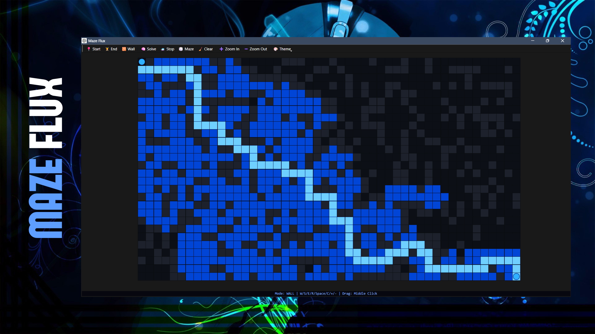
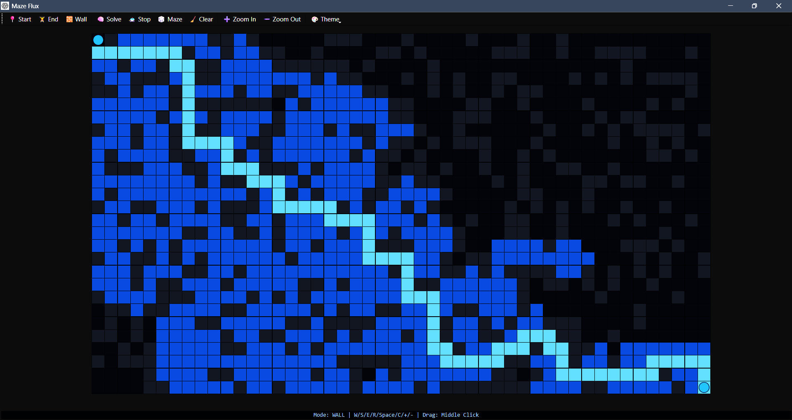

<p align="center">
  
</p>

<h1 align="center">🔷 Maze Flux</h1>
<p align="center">
  <strong>A PyQt6 desktop maze editor and A* pathfinding visualizer with animated solving, random maze generation, and interactive grid controls.</strong>
</p>

<p align="center">
  
  
  
  
</p>

## Overview

Maze Flux is a desktop visualization tool for building mazes and watching an A* pathfinding algorithm solve them. You can place start and end points, draw or erase walls, generate random solvable mazes, resize the grid, pan around the canvas, switch color themes, and animate the search process step by step.

The project is intentionally compact: the full application lives in a single `main.py` file and uses PyQt6 for the window, toolbar, drawing canvas, input handling, and timer-based animation.

## Screenshot

<p align="center">
  
</p>

## Features

- Interactive grid-based maze editor.
- Place a custom start cell and end cell.
- Draw walls by clicking and dragging.
- Erase existing walls with the same wall tool.
- Generate random solvable mazes.
- Solve the maze with A* search using Manhattan-distance heuristic.
- Animate explored cells and final solution path.
- Stop an active solve animation.
- Clear the full board.
- Resize the grid between configured minimum and maximum dimensions.
- Pan the maze canvas with middle-click dragging.
- Scrollable canvas for large maze sizes.
- Toolbar actions for common tools.
- Keyboard shortcuts for fast control.
- Blue, Red, and Purple path theme options.
- Custom window icon and project artwork.

## Technology Stack

| Area | Technology |
| --- | --- |
| Language | Python |
| GUI Framework | PyQt6 |
| Rendering | QPainter |
| Input Handling | PyQt6 mouse and keyboard events |
| Animation | QTimer |
| Pathfinding | A* search |
| Heuristic | Manhattan distance |
| Data Model | Cell grid with parent, cost, wall, visited, and path state |

## Project Structure

```text
maze-flux/
├── .gitattributes
├── LICENSE
├── README.md
├── main.py
├── banner.png
├── icon.png
└── screenshot.png
```

## Getting Started

### Prerequisites

- Python 3.10 or newer
- pip

### Installation

```bash
cd maze-flux
pip install PyQt6
```

### Run the Application

```bash
python main.py
```

On some systems, use:

```bash
python3 main.py
```

## Controls

### Toolbar

| Action | Description |
| --- | --- |
| Start | Switch to start-cell placement mode. |
| End | Switch to end-cell placement mode. |
| Wall | Switch to wall drawing/erasing mode. |
| Solve | Run and animate the A* pathfinding search. |
| Stop | Stop the active solve animation. |
| Maze | Generate a random maze that has at least one valid path. |
| Clear | Reset the grid, start/end points, paths, walls, and pan offset. |
| Zoom In | Increase grid dimensions. |
| Zoom Out | Decrease grid dimensions. |
| Theme | Choose the active path color theme. |

### Keyboard

| Key | Action |
| --- | --- |
| `S` | Start placement mode |
| `E` | End placement mode |
| `W` | Wall editing mode |
| `Space` | Solve maze |
| `R` | Generate random solvable maze |
| `C` | Clear all |
| `+` or `=` | Increase grid size |
| `-` | Decrease grid size |
| `X` | Stop solving |

### Mouse

| Input | Action |
| --- | --- |
| Left click | Place start/end cell or toggle a wall, depending on the active mode. |
| Left click + drag | Draw or erase walls continuously in wall mode. |
| Middle click + drag | Pan the maze canvas. |

## How It Works

Maze Flux represents the board as a 2D grid of `Cell` objects. Each cell stores its grid coordinate, wall state, start/end state, pathfinding values, visited state, and parent pointer.

When solving, the app:

1. Clears previous path and visited states.
2. Starts from the selected start cell.
3. Uses A* search to score neighbors with `g`, `h`, and `f` values.
4. Skips walls and already-closed cells.
5. Tracks each cell's parent so the final route can be reconstructed.
6. Queues explored cells for animation.
7. Animates visited cells first, then highlights the final solution path.

Random maze generation fills cells with walls at roughly 30% probability, sets the start to the top-left cell, sets the end to the bottom-right cell, and retries until a valid path exists.

## Configuration

The main constants are defined near the top of `main.py`:

```python
CELL_SIZE = 25
MIN_GRID = 10
MAX_GRID = 100
```

The default grid size is created in `MazeWidget(width=60, height=34)`.

## Notes

- The project does not include a `requirements.txt` file yet.
- The solve feature visualizes a standard A* path rather than comparing multiple algorithms.
- Grid resizing currently clears the board.
- Random maze generation repeats until it finds a solvable layout.

## License

This project is licensed under the MIT License. See [LICENSE](LICENSE) for details.

## Author

Ashish Kumar
